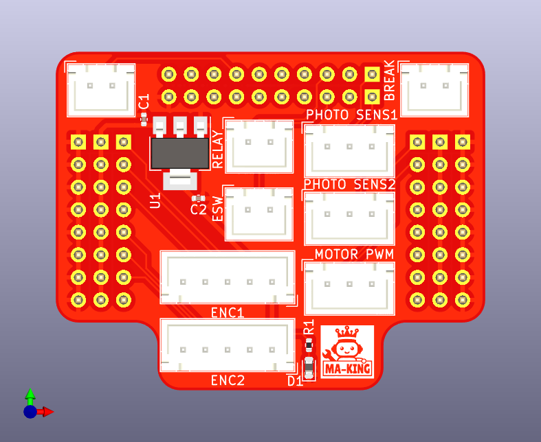
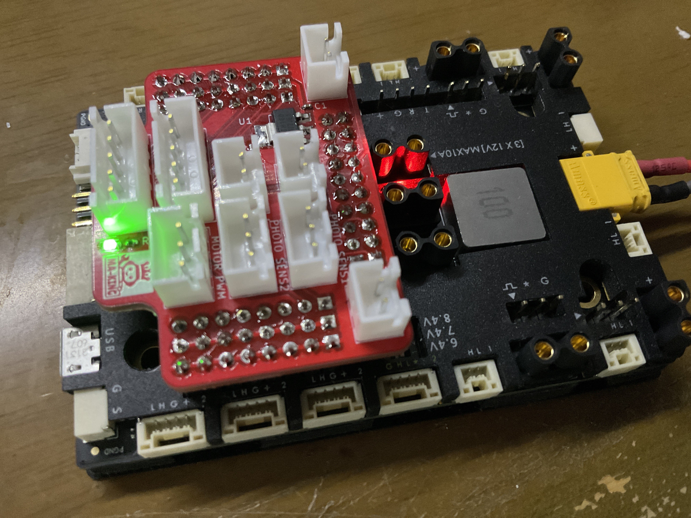
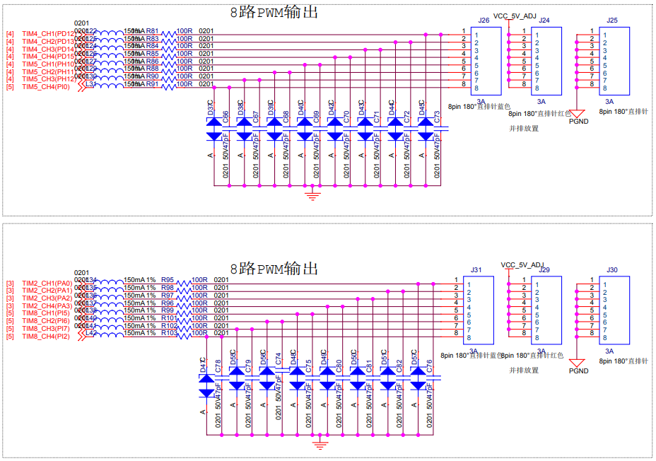
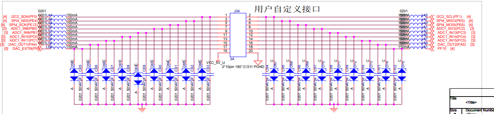

# RoboMasterHatBoard
ロボマス開発ボード用ハットです。  
CoREに出場するロボットに利用しているメインボードとして[RoboMaster 開発ボードタイプA](https://store.dji.com/jp/product/rm-development-board-type-a?vid=42041)を利用しているので、このボードから2024年大会用に必要なピンをコネクタにまとめるための基板です。

# 機能
ロボマス開発ボードにはピンヘッダからいくつかのピンが出ているので、そこから今回のロボットで利用するピンを取り出します。

具体的に以下のピンを取り出します。
|ピン名|ペリフェラル|用途|備考|
|---|---|---|---|  
|PD12|TIM4_CH1| モータ1PWM用||
|PD13|TIM4_CH2| モータ2PWM用||
|PA0|TIM2_CH1| エンコーダ1 A相||
|PA1|TIM2_CH2| エンコーダ1 B相||
|PA2|GPIO_INPUT| エンコーダ1 Z相||
|PI5|TIM8_CH1| エンコーダ2 A相||
|PI6|TIM8_CH2| エンコーダ2 B相||
|PI7|GPIO_INPUT| エンコーダ2 Z相||
|PF0|GPIO_INPUT|フォトインタラプタ1入力|マイコンの内部プルアップ必須|
|PF1|GPIO_INPUT|フォトインタラプタ2入力|マイコンの内部プルアップ必須|
|PE6|GPIO_INPUT|非常停止ボタン入力|マイコンの内部プルアップ必須|
|PE12|GPIO_OUTPUT|リレー駆動信号||
|PC3|GPIO_INPUT|撃破信号入力||
|PC1|GPIO|汎用GPIO|予備ポート|

v0.1の基板上のシルクと回路図上の信号線が逆になっているので注意。回路図が間違っているということにして基板のシルクか上の表に従えばOK。

基板上のコネクタのピンアサインは次の通り
### MOTOR PWM
|1|2|3|
|---|---|---|
|TIM4_CH1(PD12)|TIM4_CH2(PD13)|GND|

### PHOTO SENS1
|1|2|3|
|---|---|---|
|5 V|INPUT(PF0)|GND|

### PHOTO SENS2
|1|2|3|
|---|---|---|
|5 V|INPUT(PF1)|GND|

### ENC1
|1|2|3|4|5|
|---|---|---|---|---|
|3.3 V|TIM2_CH1(PA1)|TIM2_CH2(PA2)|INPUT(PA2)|GND|

### ENC2
|1|2|3|4|5|
|---|---|---|---|---|
|3.3 V|TIM8_CH1(PI5)|TIM8_CH2(Pi6)|INPUT(PI7)|GND|

### RELAY
|1|2|
|---|---|
|OUTPUT(PE12)|GND|

### ESW
|1|2|
|---|---|
|INPUT(PE6)|GND|

### BREAK
|1|2|
|---|---|
|INPUT(PC3)|GND|

### 予備ポート
|1|2|
|---|---|
|INPUT(PC1)|GND|

## 参考
ロボマス開発ボードピンヘッダ部分のピンアサインは[回路図](https://ausdroid.co/wp-content/uploads/2020/08/RoboMaster-Development-Board-Type-A-Schematic.pdf)より

