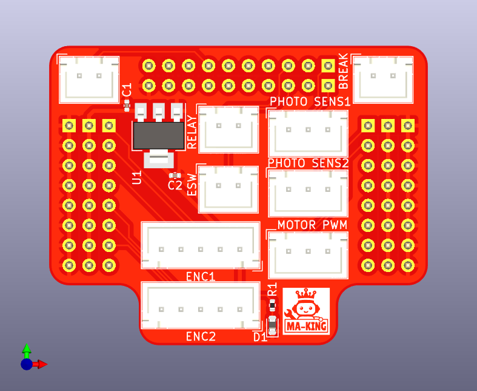

# RoboMasterHatBoard
ロボマス開発ボード用ハットです。
CoREに出場するロボットに利用しているメインボードとして[RoboMaster 開発ボードタイプA](https://store.dji.com/jp/product/rm-development-board-type-a?vid=42041)を利用しているので、このボードから2024年大会用に必要なピンをコネクタにまとめるための基板。

